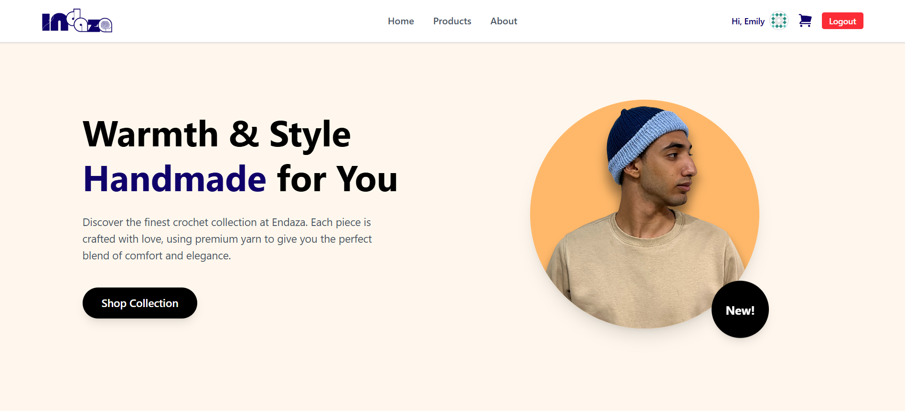

# 🧶 Indaza - Handmade E-commerce Store

A modern, responsive e-commerce web application specializing in handmade crochet products. This project demonstrates a full shopping experience including authentication, product browsing with server-side pagination, and a fully functional shopping cart state management.

🔗 **Live Demo:** [Click here to visit Indaza](INSERT_VERCEL_LINK_HERE)

 

## ✨ Key Features

### 🔐 Authentication & Security
* **User Authentication:** Fully functional Login/Logout system integrated with DummyJSON Auth API.
* **Protected Routes:** Implemented `AuthGuard` to secure sensitive routes (like the Cart) from unauthorized access.
* **Persistent Session:** User session is saved in LocalStorage to persist login state upon refresh.

### 🛍️ Shopping Experience
* **Server-Side Pagination:** Efficiently fetching products in chunks (limit & skip) to handle large datasets and improve performance.
* **Dynamic Product Details:** Detailed view for each product using React Router dynamic parameters.
* **Smart Cart System:** * Add items to cart without page reloads.
    * Update quantities (increment/decrement) with logic to prevent negative numbers.
    * Real-time total price calculation.
    * **Persistent Cart:** Cart data is saved in LocalStorage so users don't lose their items on refresh.
    * Checkout simulation.

### 🎨 UI/UX & Responsive Design
* **Responsive Navigation:** Custom-built hamburger menu for mobile devices with smooth transitions.
* **Modern Styling:** Built with **Tailwind CSS** for a clean, consistent, and "Indaza" branded aesthetic.
* **Interactive Elements:** Hover effects, loading skeletons/spinners, and toast notifications (simulated).

## 🛠️ Tech Stack

* **Frontend Library:** React.js (Vite)
* **Styling:** Tailwind CSS
* **Routing:** React Router DOM (v6)
* **State Management:** React Context API + useReducer (for complex Cart logic)
* **API:** DummyJSON (for Products & Auth)
* **Icons:** React Icons (Heroicons)

## 📂 Project Structure

```text
src/
├── components/       # Reusable UI components (Navbar, ProductCard, Footer, etc.)
├── context/          # Global State (AuthContext, CartContext)
├── pages/            # Page components (Home, Products, ProductDetails, Cart, Login)
├── routes/           # Route definitions and AuthGuard
└── main.jsx          # Entry point with Providers setup